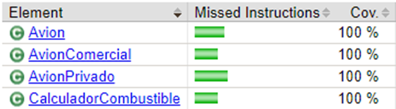
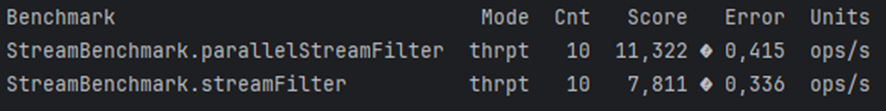

# ucse-prog2-2023-U2-Saliva

Una prueba benchmark es una evaluación estandarizada diseñada para medir el rendimiento y la capacidad de un sistema. En este caso, estamos comparando el resultado de la misma tarea, realizándolas de dos maneras diferentes, en el cual implementamos Stream y parallelStream.

Como conclusión, podemos decir que el puntaje del parallelStreamFilter es mayor al puntaje del streamFilter, esto quiere decir, que proceso mayor cantidad de operaciones por segundo con respecto al otro método, esto se da, ya que parallelStream permite la ejecución a través del uso de múltiples hilos de ejecución, mejorando así, el rendimiento.
